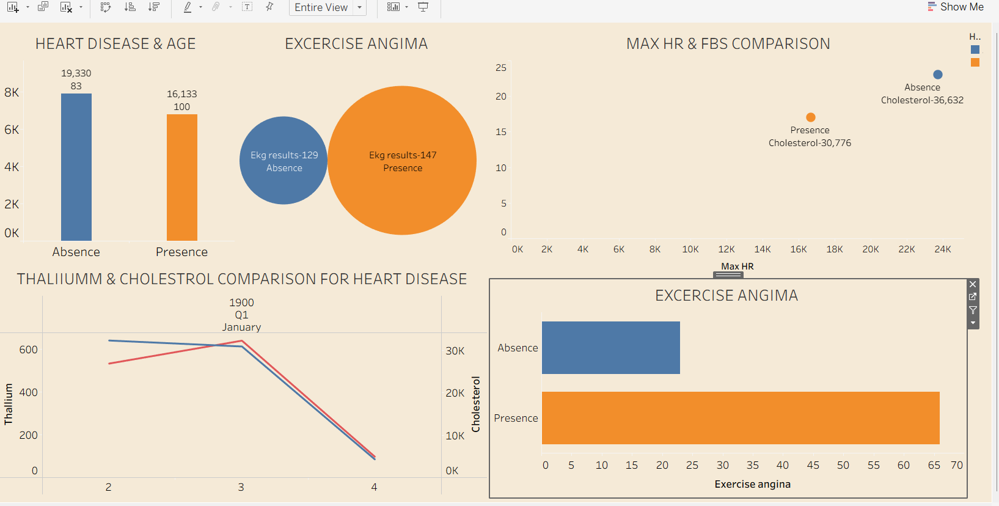

# Heart Disease Analysis Dashboard

## [View Interactive Dashboard on Tableau Public](https://public.tableau.com/views/heartdiseasedashboard_17766791500560/Dashboard1?:language=en-US&publish=yes&:sid=&:redirect=auth&:display_count=n&:origin=viz_share_link)

## Overview
This project features an interactive Tableau dashboard designed to visualize and analyze clinical factors contributing to heart disease. The goal is to provide data-driven insights into patient health trends based on key medical metrics.

